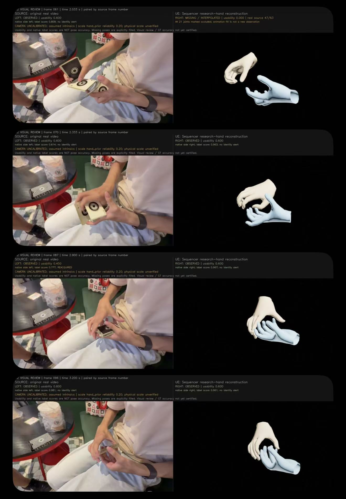
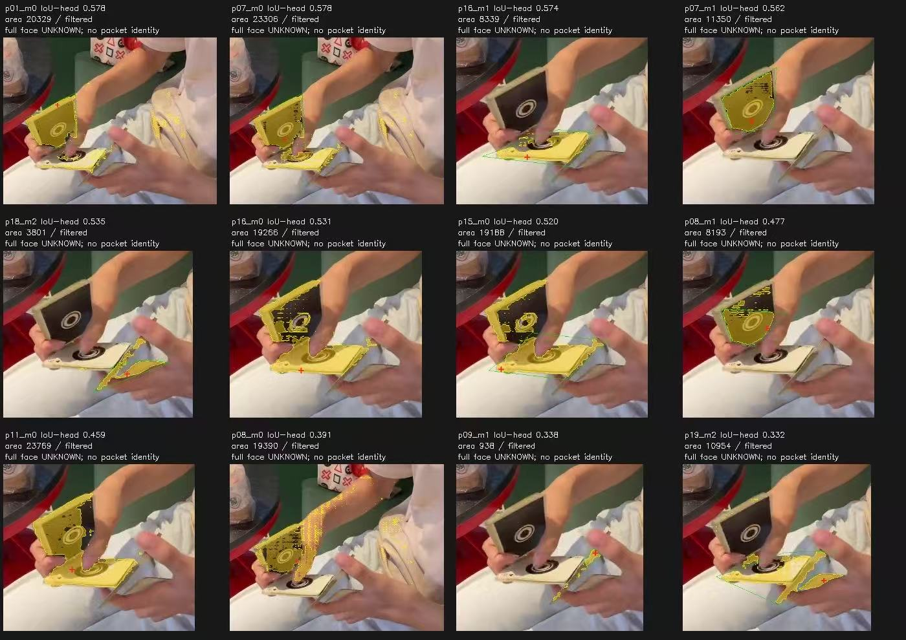

# Cardistry Auto Animation

[English](#english) | [简体中文](#简体中文)

## English

Turn a video into editable hand animation and a review scene in Unreal Engine.

**v0.0.2 targets Windows x64 / Unreal Engine 5.4; validation uses UE 5.4.4.** Results are animation drafts. Without reliable camera parameters, each hand is shown in its own local space. Relative hand placement, depth, and real-world scale remain unknown. Card reconstruction and physics simulation are not available.

### Demo preview

**Source video → hand animation in Unreal Engine.** These examples show earlier noncommercial research using the same cardistry clip. Click either image to view it at full size.

<table>
  <tr>
    <th>Source vs. reconstructed hands</th>
    <th>Experimental card-surface candidates</th>
  </tr>
  <tr>
    <td width="50%" valign="top"><a href="docs/media/hand-comparison.jpg"></a></td>
    <td width="50%" valign="top"><a href="docs/media/card-surface-candidates.jpg"></a></td>
  </tr>
</table>

**Watch the matching comparison video** — 3.23 seconds · 97 frames · 30 fps. The source is on the left and the Unreal Engine hand reconstruction is on the right. Frames 61, 70, 87, and 96 match the hand-comparison image above.

https://github.com/user-attachments/assets/9b5575d2-13fa-4fc8-bd88-d057ff2b1870

You can also [open the video separately](https://github.com/user-attachments/assets/9b5575d2-13fa-4fc8-bd88-d057ff2b1870).

The combined-hand view is an earlier experiment with unverified camera parameters and scale; v0.0.2 uses separate local hand views when camera parameters are unavailable. The card overlays are candidate masks, not verified card tracking or a released reconstruction feature. Original observation and interpolation labels are retained in the video.

MANO was used for hand animation courtesy of the Max Planck Institute for Intelligent Systems. See [model credits and license information](THIRD_PARTY_NOTICES.md).

### Quick start

#### 1. Install the plugin

Download `CardistryCapture-v0.0.2.zip` from [Releases](https://github.com/Ding808/Cardistry-Auto-Animation/releases/tag/v0.0.2). Extract the `CardistryCapture` folder into your project:

```text
YourProject/
  Plugins/
    CardistryCapture/
      CardistryCapture.uplugin
      Source/
      PythonPipeline/
      Scripts/
```

Install Visual Studio 2022 with **Game development with C++** and a Windows SDK. Close Unreal Editor, regenerate project files, and build **Development Editor / Win64**. For a Blueprint-only project, first add an empty C++ class.

You can also install under `Engine/Plugins/Marketplace/CardistryCapture`. The plugin directory must be writable during initial setup. Generated meshes, animations, and scenes belong to the active project. Project-level installation is recommended for a first setup.

#### 2. Prepare the runtime and models once

Install **64-bit Python 3.10** and an NVIDIA driver compatible with **CUDA 12.8**. Processing uses its own Python environment, separate from Unreal's Python.

The release includes the redistributable detection resource and asset-generation code. Full reconstruction also requires:

| Required files | Where to get them |
| --- | --- |
| Official MANO v1.2 ZIP, containing both hands | Register at the [MANO website](https://mano.is.tue.mpg.de/) and download under its license |
| `wilor_final.ckpt` and matching `model_config.yaml` | Follow the model download instructions in the [official WiLoR project](https://github.com/rolpotamias/WiLoR) |

Double-click **`Scripts/Setup.cmd`** inside the plugin. Follow the runtime and model license prompts, then select those files. Setup creates an isolated environment, checks the files, and prepares both hands. Initial dependency installation needs an internet connection.

MANO, WiLoR, and SMPL-X have licenses separate from the plugin code. This reconstruction combination is intended for noncommercial research that complies with those licenses. Restricted weights, MANO meshes, and editable MANO-derived 3D demo assets are not included in the public package; users prepare them locally. See [third-party notices](THIRD_PARTY_NOTICES.md).

#### 3. Process a video

1. Open **Window → Cardistry Capture**.
2. Click **Choose Video...**, select your video, then click **Start Processing**.
3. After completion, use **Preview Video** to compare the source with the separate left and right hands, or **Open Scene** to play and scrub the timeline.

Every job creates the hand meshes, skeleton, skin material, animation, review scene, cameras, and lighting. No separate scene template is needed. **Advanced Settings** are optional; start with the defaults. Use **Cancel Processing** to stop an active job.

Review yellow timeline ranges carefully. Observed, interpolated, and held poses have different source labels. Filled poses do not mean the hand was reliably detected in those frames.

### Review and save results

| Control | Purpose |
| --- | --- |
| **Open Scene** | Open the map and timeline at frame 0; local mode initially shows the left hand |
| **Open Animation** | Open the animation asset; disabled in local mode |
| **Preview Video** | Compare the source with each hand's separate local motion |
| **Result Folder** | Find the preview, exchange data, and processing records |
| **View Log** | Read failure details before correcting the issue and starting a new job |

To view the right hand in a local scene, select the hand actor's skeletal mesh component and toggle **Local Hand Preview → Show right hand locally**. This changes the display only; it does not establish the hands' spatial relationship. **Open Animation** is disabled in local mode because a combined viewer would place two independent origins together. Use **Open Scene** or **Preview Video** instead.

- Unreal assets: project content `CardistryCapture/Generated/<job-id>`.
- Processing files: project `Saved/CardistryCapture/Runs/<job-id>`.
- Local review video: `Preview/review.mp4` inside that job's result folder. Sharing remains subject to the source footage and model licenses.

Every job saves separate results. Closing the panel leaves processing running; closing Unreal Editor stops the job.

### Upgrading from v0.0.1

Close Unreal Editor before updating. At the same plugin location, keep your own `.venv`, model files, and local runtime cache; update `Source`, `Config`, `Scripts`, the Python code and release manifests, the plugin descriptor, and documentation. Rebuild **Development Editor / Win64**, then run `Scripts/Setup.cmd` to complete the version's readiness check. Do not replace your environment with someone else's `.venv`.

For a simpler clean installation, extract v0.0.2 into a new location and run setup with your licensed model files before processing. A new location needs its own environment preparation.

### Troubleshooting

**No menu after compiling?** Enable **Cardistry Capture** under **Edit → Plugins**, then restart. UE 5.4.4 is the validated engine version; other versions may need source changes.

**Missing Python or models?** Run `Scripts/Setup.cmd` from the installed plugin and complete its readiness check. Do not copy another computer's `.venv`. Recreate the environment after moving the plugin.

**Slow dependency download?** Download `CardistryCapture-RuntimeDeps-v0.0.2.zip` from the same release and provide it as a local archive. Other dependencies still need an internet connection. See [setup options](Scripts/README.md#english).

**Motion does not match the video?** Occlusion, hand identity, and finger pose errors remain possible. Use clear, evenly lit footage with both hands in view, and check the source labels for filled frames. The v0.0.2 language update does not improve reconstruction accuracy.

### Building and licensing

The plugin is distributed as source. Use `Scripts/Build-Plugin.ps1` for command-line builds; see [script instructions](Scripts/README.md#english). The editor module uses Unreal's built-in Level Sequence Editor and Interchange components.

The plugin's own code is covered by [LICENSE](LICENSE). Third-party code, detection resources, and runtime libraries retain their respective licenses. See the [changelog](CHANGELOG.md).

## 简体中文

在 Unreal Engine 中选择一段视频，生成可编辑的手部动画和配套查看场景。

**v0.0.2 面向 Windows x64 / Unreal Engine 5.4，验证环境为 UE 5.4.4。** 当前输出是动作初稿：缺少可靠相机参数时，左右手分别显示局部动作，双手相对位置、深度和真实尺度保持未知。扑克牌重建和物理模拟尚未提供。

### 演示预览

前面的[演示区](#demo-preview)包含两张可点击放大的图片：原视频与 UE 手部重建的逐帧对照，以及实验性的牌面候选掩膜。配套[对比视频](https://github.com/user-attachments/assets/9b5575d2-13fa-4fc8-bd88-d057ff2b1870)为同一段素材的完整 97 帧，共 3.23 秒、30 fps；左侧为原视频，右侧为 UE 重建，手部对照图对应其中第 61、70、87、96 帧。

这些是早期非商业研究演示：合并双手画面的相机参数和尺度尚未验证，v0.0.2 在缺少相机参数时显示各自的局部动作。牌面覆盖图只表示候选掩膜，不代表已验证的扑克牌追踪或已发布的重建功能。视频保留原有检测与插值状态标注。

手部动画使用 MANO，鸣谢 Max Planck Institute for Intelligent Systems。模型署名和许可见[第三方资源说明](THIRD_PARTY_NOTICES.md)。

### 快速开始

#### 1. 安装插件

从 [Releases](https://github.com/Ding808/Cardistry-Auto-Animation/releases/tag/v0.0.2) 下载 `CardistryCapture-v0.0.2.zip`，解压得到 `CardistryCapture` 文件夹，将整个文件夹放入工程：

```text
你的工程/
  Plugins/
    CardistryCapture/
      CardistryCapture.uplugin
      Source/
      PythonPipeline/
      Scripts/
```

安装 Visual Studio 2022 的 **使用 C++ 的游戏开发** 工作负载和 Windows SDK。关闭编辑器，重新生成工程文件，编译工程的 **Development Editor / Win64**。纯蓝图工程可先添加一个空 C++ 类。

也可放入引擎的 `Engine/Plugins/Marketplace/CardistryCapture`；首次准备环境时需要该目录的写入权限。日常生成的模型、动画和场景归属于当前工程。新手建议使用工程内安装。

#### 2. 首次准备处理环境和模型

先安装 **64 位 Python 3.10**，并准备支持 **CUDA 12.8** 的 NVIDIA 驱动。处理使用独立 Python 环境，不使用 UE 自带的 Python。

本发行包包含可公开分发的检测资源和资源生成代码。完整重建还需要：

| 所需文件 | 获取位置 |
| --- | --- |
| MANO v1.2 官方 ZIP，包含左右手 | 在 [MANO 官网](https://mano.is.tue.mpg.de/)注册并按其许可下载 |
| `wilor_final.ckpt` 和匹配的 `model_config.yaml` | 按 [WiLoR 官方项目](https://github.com/rolpotamias/WiLoR)的模型下载说明获取 |

双击插件内 **`Scripts/Setup.cmd`**，按提示确认运行库和模型的适用许可，再选择这些文件。安装器会创建独立环境、校验文件并准备左右手；首次需要联网下载依赖。

MANO、WiLoR、SMPL-X 的许可与插件代码许可分开，当前重建组合面向符合这些许可的非商业研究用途。公开包不含受限权重、MANO 手模或其可编辑的派生三维演示资产；它们由使用者在本机准备。详情见 [第三方资源说明](THIRD_PARTY_NOTICES.md)。

#### 3. 处理视频

1. 在 **Window → Cardistry Capture** 打开面板。
2. 点击 **Choose Video...** 选择视频，然后点击 **Start Processing** 开始处理。
3. 完成后点击 **Preview Video** 对照“原视频 / 左手 / 右手”，或点击 **Open Scene** 打开场景，播放、拖动时间线。

每次任务自动生成手部网格、骨架、肤色材质、动画、查看场景、相机和照明，不需要另找场景模板。**Advanced Settings** 为可选高级设置，初次使用可保持默认。处理过程中可点击 **Cancel Processing** 取消任务。

黄色时间区段建议重点复核。检测、插值和保持的动作有不同来源标签；补出的动作不代表该帧被可靠识别。

### 查看和保存结果

| 界面按钮 | 用途 |
| --- | --- |
| **Open Scene** | 打开地图和时间线，定位第 0 帧；局部模式默认显示左手 |
| **Open Animation** | 打开动画资产；局部模式下停用 |
| **Preview Video** | 对照原视频与两只手各自的局部动作 |
| **Result Folder** | 查看本次预览、交换数据和处理记录 |
| **View Log** | 查看失败原因，修正后重新处理 |

局部场景中切换右手：选中手部 actor 的骨骼网格组件，在 **Local Hand Preview → Show right hand locally** 切换。此操作只改变显示，不确定双手空间关系。局部模式下 **Open Animation** 按钮停用，因为普通动画查看器会把两个独立原点放在一起；请使用 **Open Scene** 或 **Preview Video**。

- UE 资源：工程内容 `CardistryCapture/Generated/<任务编号>`。
- 处理文件：工程 `Saved/CardistryCapture/Runs/<任务编号>`。
- 本地预览：本次结果目录的 `Preview/review.mp4`。分享时仍须遵守素材和模型的适用许可。

每次处理保存独立结果。关闭面板不会中断任务；关闭整个编辑器会停止任务。

### 从 v0.0.1 升级

更新前关闭 Unreal Editor。同一插件位置升级时，可保留自己已有的 `.venv`、模型文件和本地运行库缓存；更新 `Source`、`Config`、`Scripts`、Python 代码和发行清单、插件描述文件及文档。重新编译 **Development Editor / Win64**，再运行 `Scripts/Setup.cmd` 完成本版本的就绪检查。不要用他人的 `.venv` 覆盖自己的环境。

更简单的干净安装方式：将 v0.0.2 解压到新位置，在处理视频前运行安装器并提供自己获许可的模型文件。新位置需要单独准备运行环境。

### 常见问题

**编译后没有菜单？** 在 **Edit → Plugins** 中启用 **Cardistry Capture**，并重新启动。UE 5.4.4 是已验证的引擎版本；其他版本可能需要适配源码。

**提示缺少 Python 或模型？** 在插件所在位置重新运行 `Scripts/Setup.cmd`，完成最后的就绪检查。不要复制其他电脑的 `.venv`；移动插件后也应重建环境。

**首次依赖下载较慢？** 可从同一 Release 下载 `CardistryCapture-RuntimeDeps-v0.0.2.zip`，安装时指定本地包。其余依赖仍需联网下载。详见 [安装参数](Scripts/README.md#简体中文)。

**结果不贴合原片？** 当前仍可能出现遮挡、左右手身份和手指姿态错误。优先使用清晰、光线均匀、双手持续入镜的视频，并对照来源标签检查补帧。v0.0.2 的语言更新不提高重建精度。

### 编译与许可

插件以源码形式提供。命令行编译可使用 `Scripts/Build-Plugin.ps1`；参数见 [脚本说明](Scripts/README.md#简体中文)。编辑器模块依赖 UE 自带的 Level Sequence Editor 与 Interchange 组件。

插件自有代码见 [LICENSE](LICENSE)，第三方源码、检测资源和运行库保留各自许可。更新记录见 [CHANGELOG.md](CHANGELOG.md)。
